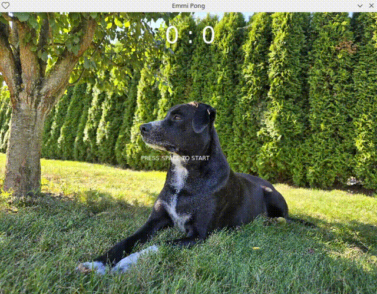

# Emmi Pong

Ein Pong-Klon, gebaut mit **Lua** und der **LÖVE2D Game Engine** — Lernprojekt für Spieleprogrammierung, Vektorphysik und den LÖVE Game-Loop.



## Voraussetzungen

Entwickelt und getestet unter **Fedora 44**. Andere Plattformen sind nicht getestet.

**LÖVE2D installieren** (Version 11.x oder neuer):

```bash
sudo dnf install love
```

Nach der Installation prüfen, ob LÖVE2D erreichbar ist:

```bash
love --version
```

## Starten

1. Ein Terminal öffnen
2. In den Projektordner wechseln:

```bash
cd Pfad/zum/Ordner/emmi-pong
```

3. Spiel starten:

```bash
love .
```

Der Punkt steht für „aktueller Ordner" — LÖVE2D sucht dort nach der Datei `main.lua` und startet das Spiel.

## Steuerung

| Taste | Aktion |
|-------|--------|
| `Space` | Spiel starten / nach Game Over neu starten |
| `P` | Pause ein-/ausschalten |
| `Escape` | Spiel beenden |
| `+` | Vollbild aktivieren |
| `-` | Vollbild deaktivieren |

### Spieler A (links)

| Taste | Aktion |
|-------|--------|
| `W` | Paddle nach oben |
| `S` | Paddle nach unten |

### Spieler B (rechts)

| Taste | Aktion |
|-------|--------|
| `↑` | Paddle nach oben |
| `↓` | Paddle nach unten |

### Ball-Geschwindigkeit (beide Spieler)

| Taste | Aktion |
|-------|--------|
| `→` | Ball beschleunigen |
| `←` | Ball abbremsen |

## Spielregeln

- Wer den Ball am Paddle des Gegners vorbeibringt, erhält einen Punkt.
- Gewonnen hat, wer zuerst **5 Punkte** erzielt.
- Die Ballgeschwindigkeit steigt alle 10 Sekunden automatisch an.
- Der Auftreffpunkt am Paddle beeinflusst den Abprallwinkel.

## Projektstruktur

```
main.lua          # Gesamter Spielcode (ein-Datei-Prototyp)
assets/
  graphics/       # Hintergrundbild
  sounds/         # Soundeffekte (Start, Treffer, Game Over)
sounds/           # Kenney-Soundpacks (Lizenz siehe sounds/License.txt)
Backlog.md        # Geplante Features und Lernziele
Claude.md         # Kontext und Lernziele für die Zusammenarbeit mit Claude
```

## Lernziele

Das Projekt entsteht als praktischer Einstieg in:

- **Lua** — Syntax, Tabellen, Module, Scoping
- **LÖVE2D** — Game-Loop, Input, Zeichnen, Asset-Loading
- **Spieleprogrammierung** — `dt`-basierte Bewegung, Kollisionserkennung, Spielzustände
- **Vektormathematik** — Normalisierung, Richtungsvektoren, Abprallwinkel

## Lizenz

Dieses Projekt steht unter der [MIT-Lizenz](LICENSE).

Die Soundeffekte im Ordner `assets/sounds/` stammen von Kenney (CC0) — siehe `assets/sounds/License.txt`.

## Notizen

- **Sound** -- https://pixabay.com/sound-effects/search/video%20game
